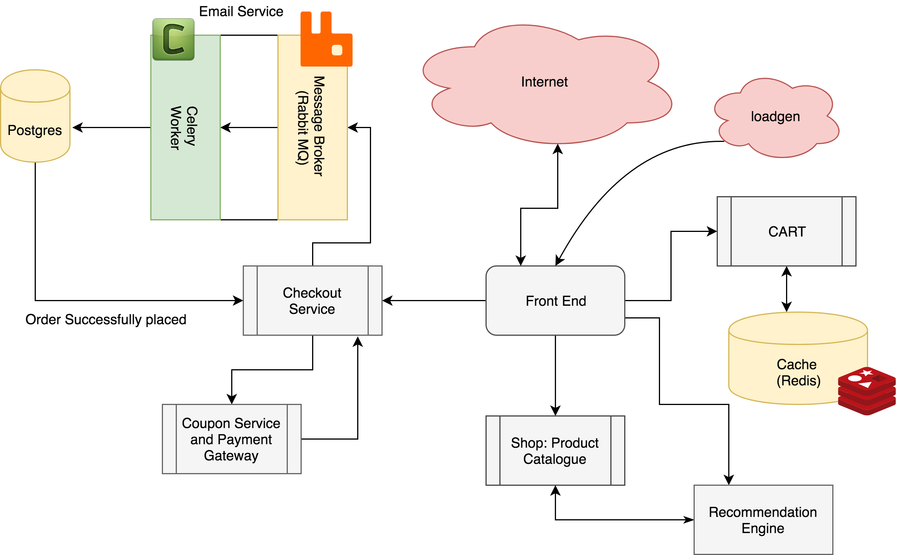

# Multi-tier-app
### Topology


# Procedure.
 To bring up all the pods and services, Run the following script. <br />
 `./run_all.sh`

 This should bring up all the pods. You can monitor it using: <br />
 ```
kubectl get pods -o wide
kubectl get svc
```

 
